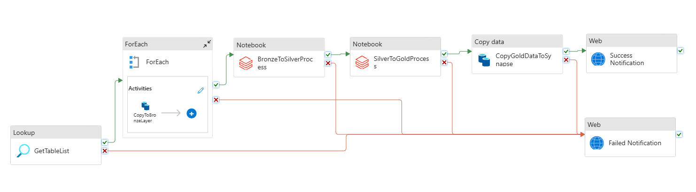

# Fintech Data Migration Pipeline

## Tech Stack

- **SQL**
- **Python**
- **PySpark**
- **Azure Data Factory (ADF)**
- **Azure Databricks**
- **Azure SQL Database**
- **Azure Synapse Analytics**
- **Azure Data Lake Storage (ADLS)**
- **Parquet/Delta Formats**
- **Azure DevOps**
- **Azure Logic Apps**

## Project Overview

This project is a **Fintech Data Migration Pipeline** built using a combination of **Azure** services and **PySpark**. The pipeline is designed to efficiently handle and process large volumes of financial data. It follows the **Medallion Architecture** and adopts a **Star Schema** for the data warehouse design.

## Architecture

The pipeline uses a **Medallion Architecture**, which consists of three layers:
1. **Bronze Layer**: Raw data is ingested and stored.
2. **Silver Layer**: Data is validated and cleaned.
3. **Gold Layer**: Business-ready data for analytics and reporting.

### System Design

### Data Warehouse Design

     +-------------------+          +-------------------------+          +-----------------------+         +-------------------+   
     |    dim_loans      |          |     fact_payments       |          |   fact_transactions   |         |    dim_accounts   |   
     +-------------------+          +-------------------------+          +-----------------------+         +-------------------+
     | loan_id     INT   |          | payment_id    INT PK    |          | trans_id    INT PK    |         | account_id   INT  |
     | loan_type   STR   |<---------| loan_id       INT FK    |          | account_id  INT FK    |-------->| acct_type    STR  |
     | loan_amt    FLOAT |          | customer_id   INT FK    |          | customer_id INT FK    |         | balance      FLOAT| 
     | int_rate    FLOAT |          | payment_dt    DT        |          | trans_dt    DT        |         | open_date    DATE |
     | loan_start  DATE  |          | payment_amt   FLOAT     |          | amount      FLOAT     |         | acct_age_yrs INT  |
     | loan_end    DATE  |          | payment_method STR      |          | trans_type  STR       |         |                   |  
     | tot_interest FLOAT|          |                         |          | description STR       |         |                   |  
     | loan_dur_yrs INT  |          |                         |          |                       |         |                   |
     +-------------------+          +-------------------------+          +-----------------------+         +-------------------+ 
                                                    \                            /                                                    
                                                     \                          /                                                    
                                                      \                        /                                                      
                                                       \                      /                                                      
                                                        \                    /                                                      
                                                         v                  v                                                                       
                                                         +-------------------+                                                                
                                                         |   dim_customers   |                                                                
                                                         +-------------------+                                                                
                                                         | customer_id  INT  |                                                                
                                                         | first_name   STR  |                                                                
                                                         | last_name    STR  |                                                                
                                                         | email        STR  |                                                                
                                                         | phone_no     STR  |                                                                
                                                         | address      STR  |                                                                
                                                         | city         STR  |                                                                
                                                         | state        STR  |                                                                
                                                         | country      STR  |                                                                
                                                         | zip_code     STR  |                                                                
                                                         | signup_dt    DT   |                                                                
                                                         +-------------------+              

### Data Flow

1. **Data Ingestion**:
   - Data is fetched from the **Azure SQL Database** using **ADF**.
   - The raw data is saved in the **Bronze Layer** of **ADLS** in **Parquet format**.

2. **Data Validation**:
   - A **Databricks Notebook** is triggered to process the data from the **Bronze Layer**.
   - The notebook performs data validations and transformations.
   - The validated data is saved in the **Silver Layer** of **ADLS**.

3. **Data Enrichment**:
   - Another **Databricks Notebook** is triggered to process the data from the **Silver Layer**.
   - This step includes complex transformations such as joins.
   - The enriched data is saved in the **Gold Layer** of **ADLS**.

4. **Data Warehouse**:
   - The **Gold Layer** data is copied to **Azure Synapse Analytics** for reporting and analytics.

### Notifications

- **Success Email**: Sent via **Azure Logic Apps** when the pipeline successfully completes all stages.
- **Failure Email**: Sent via **Azure Logic Apps** if any stage of the pipeline fails.

## Features

- **Scalable and Efficient**: Built for handling large volumes of data.
- **Data Quality Assurance**: Validations ensure data integrity at every stage.
- **Automated Workflow**: Fully automated using Azure services and Databricks notebooks.
- **Error Handling**: Robust notification mechanism for failure scenarios.
- **Star Schema**: Optimized for analytical queries in Synapse.

## Steps for CI/CD Setup:

1. **Configure Repository**:
   - Clone the project repository and configure branch policies for main and development branches.

2. **Setup Build Pipeline**:
   - Define a build pipeline to validate the code and create artifacts (Databricks notebooks, ADF pipelines, ARM templates).

3. **Create Release Pipeline**:
   - Deploy build artifacts across environments (DEV, QA, PROD).

4. **Configure ARM Templates Deployment**:
   - Deploy or update Azure resources using ARM templates for all services involved.

5. **Setup CI/CD Pipeline for Automated and Sequential Execution**:
   - Ensure the pipeline triggers in sequence for data ingestion, validation, enrichment, and loading to Synapse.

6. **Setup Azure DevOps Account and Create Organization, Project, Repository & Agent Pool**:
   - Sign up for Azure DevOps.
   - Create an **Organization**, set up a **Project**, and configure a **Repository**.
   - Create an **Agent Pool** to allow pipeline jobs to run on your local machine or hosted environment.

7. **Setup Automated Release Process and Deployment of Updated ARM Templates in PROD ADF Pipeline**:
   - Configure the release pipeline to automate deployment of new or updated ARM templates.
   - Ensure PROD ADF pipelines are always in sync with the latest changes from the repository.                                                  
                                                       
                                                      
                                                                                            

 

                                                                                                    

